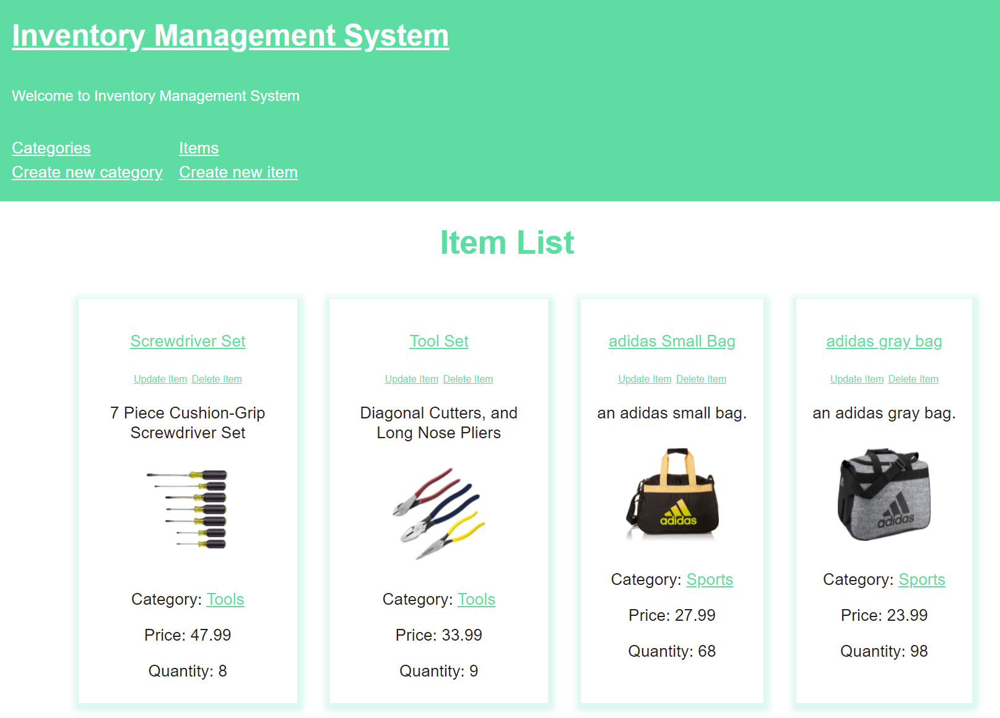

# Inventory Management System

# Description

         An Full-stack inventory management web app built for The Odin Project.

[<h2>Live Demo</h2>](https://aqueous-reaches-05099.herokuapp.com/)

# Built With

-   Node.js
-   Express
-   ejs

# Feature:

Create new Category/Item  
Update/Delate Category/Item  
Safe execution logic
